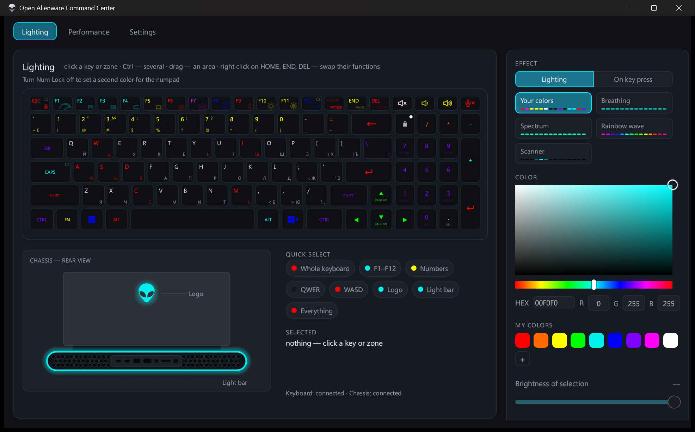
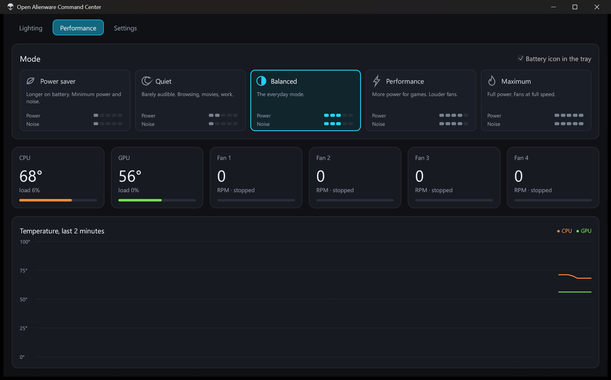
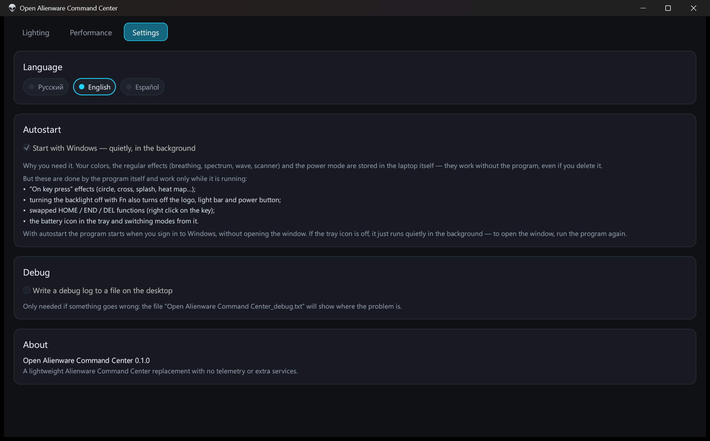

[Русский](README.md) | **English** | [Español](README.es.md)

# Open Alienware Command Center

A lightweight portable replacement for Alienware Command Center on the Alienware m18 R2: lighting, power modes, sensors and a tray icon. No telemetry, no services, no installation — a single exe. The interface is available in English, Russian and Spanish.



## Installation

1. Download `Open.Alienware.Command.Center.exe` from Releases.
2. Put it in any folder and run it.

Settings are stored in a file next to the exe, so the program can be moved together with its folder. It asks for administrator rights by itself: power modes and sensors don't work without them.

## Features

### Lighting
- Your own color for every key, the logo and the light bar
- Select several keys with Ctrl or by dragging, quick groups (F1–F12, numbers, WASD and more)
- Saved color presets and a “My colors” palette
- Keyboard effects: breathing, spectrum, rainbow wave, scanner
- “On key press” effects: ripple, cross, rays, splash, heat map
- A second numpad color while Num Lock is off
- Turning the backlight off with Fn also turns off the logo, light bar and power button
- Right click on HOME / END / DEL swaps their functions

### Performance
- Five Dell modes: Power saver, Quiet, Balanced, Performance, Maximum
- CPU and GPU temperature and load, fan speeds
- Temperature graph for the last 2 minutes



### Tray and background
- Battery icon in the tray: charge, plugged in or on battery, current mode
- Left click switches to Power saver and back, right click opens a menu with all modes
- A closed window doesn't hold memory: only a small ~4 MB part stays in the background
- Start with Windows

### Settings
- Language: English, Russian, Spanish (defaults to the Windows language)
- Autostart and debug log



## Building

Rust, GNU toolchain:

```
cargo +stable-x86_64-pc-windows-gnu build --release
```

Output: `target/release/AlienCenter.exe`.
