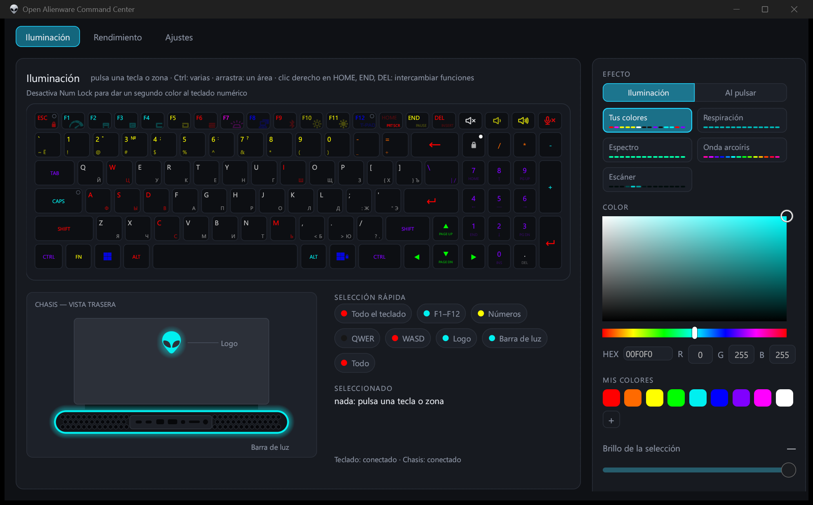
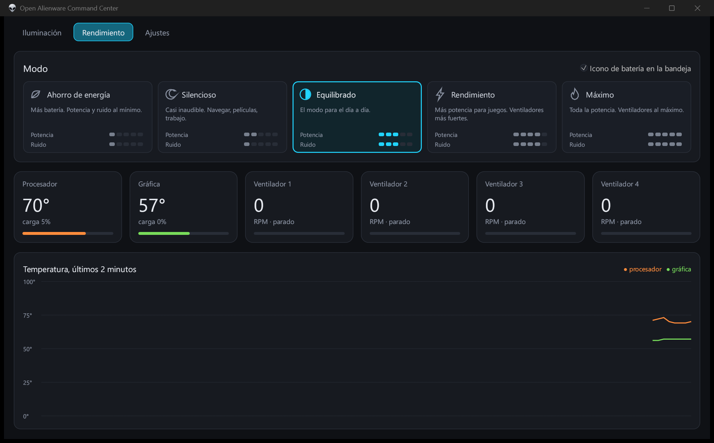
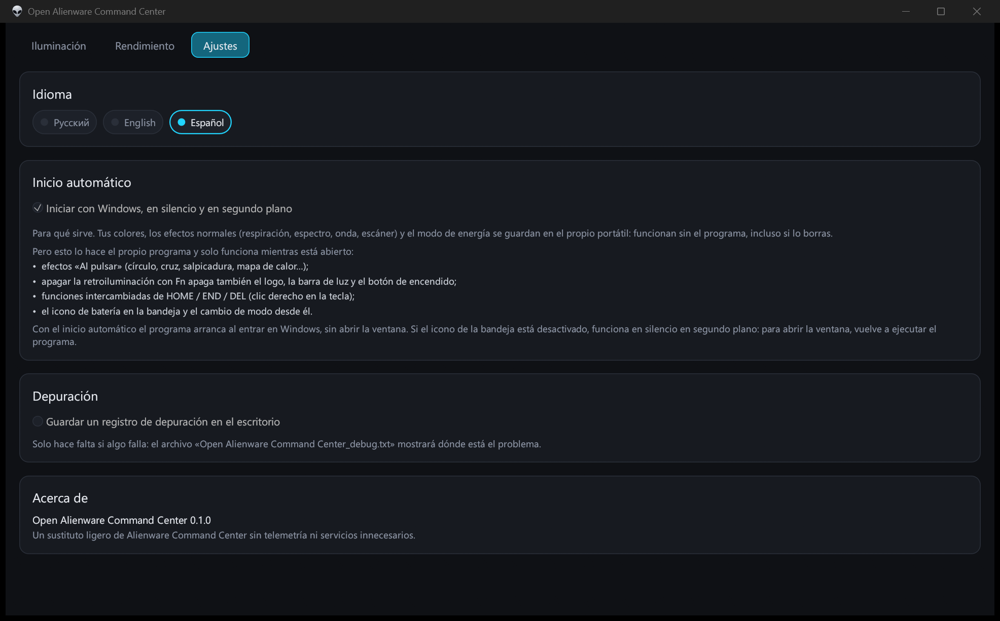

[Русский](README.md) | [English](README.en.md) | **Español**

# Open Alienware Command Center

Un sustituto ligero y portátil de Alienware Command Center para el Alienware m18 R2: iluminación, modos de energía, sensores e icono en la bandeja. Sin telemetría, sin servicios y sin instalación: un solo exe. La interfaz está en español, inglés y ruso.



## Instalación

1. Descarga `Open.Alienware.Command.Center.exe` desde Releases.
2. Ponlo en cualquier carpeta y ejecútalo.

Los ajustes se guardan en un archivo junto al exe, así que el programa se puede mover con su carpeta. Pide permisos de administrador por sí mismo: sin ellos no funcionan los modos de energía ni los sensores.

## Funciones

### Iluminación
- Un color propio para cada tecla, el logo y la barra de luz
- Selección de varias teclas con Ctrl o arrastrando, grupos rápidos (F1–F12, números, WASD y más)
- Conjuntos de colores guardados y la paleta «Mis colores»
- Efectos del teclado: respiración, espectro, onda arcoíris, escáner
- Efectos «Al pulsar»: onda, cruz, rayos, salpicadura, mapa de calor
- Un segundo color para el teclado numérico con Num Lock desactivado
- Apagar la retroiluminación con Fn apaga también el logo, la barra de luz y el botón de encendido
- Clic derecho en HOME / END / DEL intercambia sus funciones

### Rendimiento
- Cinco modos de Dell: Ahorro de energía, Silencioso, Equilibrado, Rendimiento, Máximo
- Temperatura y carga del procesador y la gráfica, velocidad de los ventiladores
- Gráfico de temperatura de los últimos 2 minutos



### Bandeja y segundo plano
- Icono de batería en la bandeja: carga, conectado o con batería, modo actual
- Clic izquierdo: Ahorro de energía y de vuelta; clic derecho: menú con todos los modos
- La ventana cerrada no ocupa memoria: en segundo plano solo queda una pequeña parte de ~4 MB
- Inicio con Windows

### Ajustes
- Idioma: español, inglés, ruso (por defecto, el de Windows)
- Inicio automático y registro de depuración



## Compilación

Rust, toolchain GNU:

```
cargo +stable-x86_64-pc-windows-gnu build --release
```

Archivo final: `target/release/AlienCenter.exe`.
