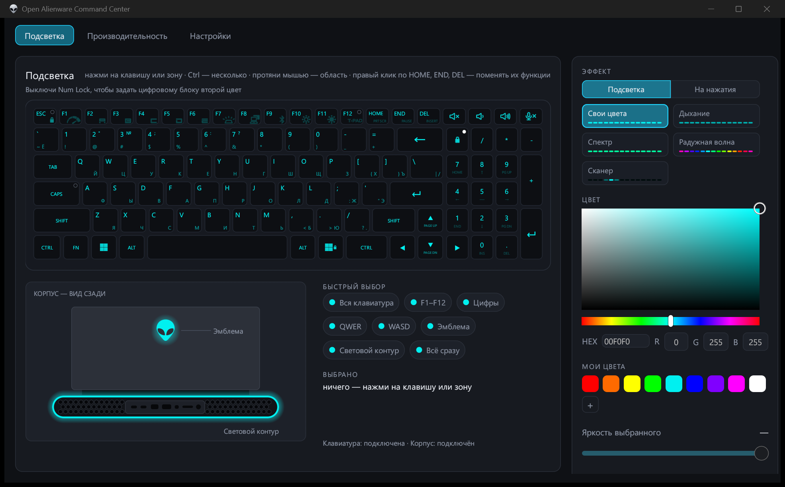
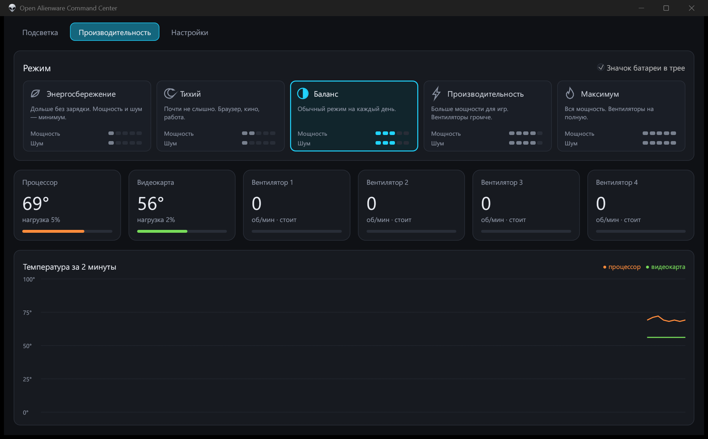
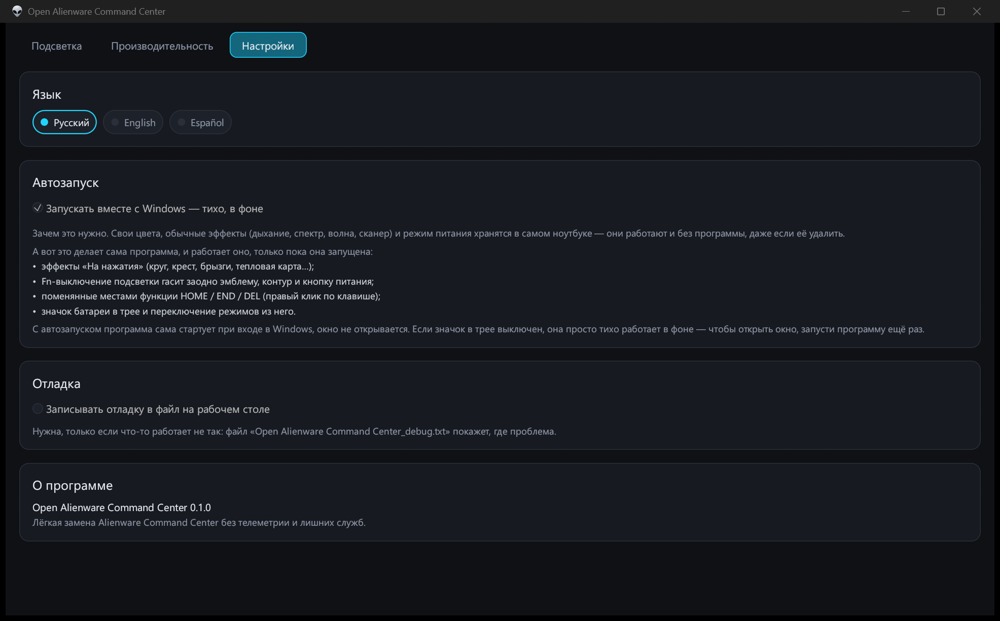

**Русский** | [English](README.en.md) | [Español](README.es.md)

# Open Alienware Command Center

Лёгкая портативная замена Alienware Command Center для Alienware m18 R2: подсветка, режимы питания, датчики и значок в трее. Без телеметрии, служб и установки — один exe. Интерфейс на русском, английском и испанском.



## Установка

1. Скачайте `Open.Alienware.Command.Center.exe` из раздела Releases.
2. Положите в любую папку и запустите.

Настройки хранятся в файле рядом с exe — программу можно переносить вместе с папкой. Права администратора программа попросит сама: без них не работают режимы питания и датчики.

## Возможности

### Подсветка
- Свой цвет для каждой клавиши, эмблемы и светового контура
- Выделение нескольких клавиш с Ctrl или рамкой мышью, быстрый выбор групп (F1–F12, цифры, WASD и др.)
- Свои наборы цветов и палитра «Мои цвета»
- Эффекты клавиатуры: дыхание, спектр, радужная волна, сканер
- Эффекты «На нажатия»: круг, крест, лучи, брызги, тепловая карта
- Второй цвет цифрового блока, когда Num Lock выключен
- Fn-выключение подсветки гасит заодно эмблему, контур и кнопку питания
- Правый клик по HOME / END / DEL меняет местами их функции

### Производительность
- Пять режимов Dell: Энергосбережение, Тихий, Баланс, Производительность, Максимум
- Температура и нагрузка процессора и видеокарты, обороты вентиляторов
- График температуры за 2 минуты



### Трей и фон
- Значок батареи в трее: заряд, питание от сети или батареи, текущий режим
- Левый клик — Энергосбережение и обратно, правый — меню со всеми режимами
- Закрытое окно не держит память: в фоне остаётся маленькая часть на ~4 МБ
- Автозапуск вместе с Windows

### Настройки
- Язык: русский, английский, испанский (по умолчанию — как в Windows)
- Автозапуск и отладка



## Сборка

Rust, toolchain GNU:

```
cargo +stable-x86_64-pc-windows-gnu build --release
```

Готовый файл: `target/release/AlienCenter.exe`.
